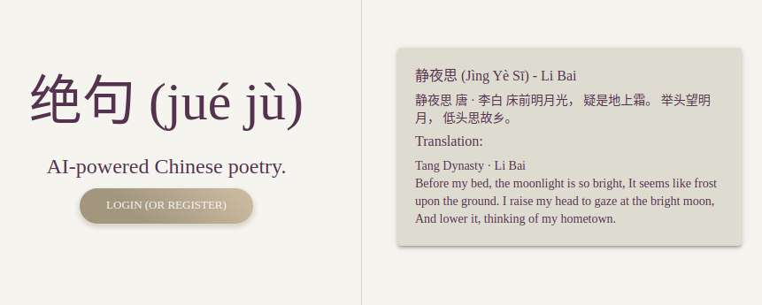

<!--
 Copyright 2024 Robert Cronin

 Licensed under the Apache License, Version 2.0 (the "License");
 you may not use this file except in compliance with the License.
 You may obtain a copy of the License at

     https://www.apache.org/licenses/LICENSE-2.0

 Unless required by applicable law or agreed to in writing, software
 distributed under the License is distributed on an "AS IS" BASIS,
 WITHOUT WARRANTIES OR CONDITIONS OF ANY KIND, either express or implied.
 See the License for the specific language governing permissions and
 limitations under the License.
-->

# [JueJu - AI-powered Chinese Poetry](https://jueju.robertcronin.com)

## Overview

JueJu is an AI-powered Chinese poetry platform that allows users to explore, create and share Chinese 绝句 or jué jù, a form of Chinese poetry that consists of four lines of five or seven characters each. It leverages the power of GenAI to generate custom poetry based on categories and themes provided by the user. The platform allows users to share their creations with the community and explore poetry created by others.

## Technical Aspects

JueJu is a full-stack application with a frontend built in React and TypeScript, and a backend developed in Go. The frontend makes use of the Vite build tool for faster builds. It also uses Material UI for styling and React Router for navigation.

The backend is a Go-based service, build with OpenAPI for API documentation and validation, Auth0 for authentication, a Redis/PostgreSQL database setup for data storage.

The generation of poetry is powered by the sleeper-service, a Go microservice that generates handles GenAI requests with the OpenAI API.

Both frontend and backend are containerized using Docker, build with GitHub Actions and pushed to GitHub Container Registry.
The production app is deployed to my [homelab](https://github.com/robert-cronin/homelab), a local Kubernetes cluster built on Rasberry Pi's. The website is exposed via a Cloudflare Argo Tunnel.

### Frontend

The frontend is bootstrapped with Vite, a modern front-end build tool that offers faster and leaner development experience for modern web projects. It uses React as the UI library and TypeScript for static type checking. The project structure is organized in a modular way, with separate directories for components and pages.

Here are a list of the key libraries and tools used in the frontend:

- [React](https://reactjs.org/): A JavaScript library for building user interfaces.
- [Vite](https://vitejs.dev/): A build tool that aims to provide a faster and leaner development experience for modern web projects.
- [Material-UI](https://material-ui.com/): A popular React UI framework that provides a set of components and styles for building responsive web applications.
- [React Router](https://reactrouter.com/): A routing library for React that enables navigation and URL handling in a React application.
- [styled-components](https://styled-components.com/): A CSS-in-JS library that allows you to write CSS code inside your JavaScript components.

### Backend

The backend service is written in Go, a statically typed, compiled language that is efficient for building scalable and reliable web services.

Here are a list of the key libraries and tools used in the backend:

- [Fiber](https://github.com/gofiber/fiber): Express inspired web framework for Go.
- [oapi-codegen](https://github.com/oapi-codegen/oapi-codegen): A command-line tool and library to convert OpenAPI specifications to Go code
- [Auth0](https://auth0.com/): A flexible, drop-in solution to add authentication and authorization services to your applications.
- [Redis](https://redis.io/): An open-source, in-memory data structure store used as a database, cache, and message broker.
- [PostgreSQL](https://www.postgresql.org/): A powerful, open-source object-relational database system.

### Scripts

The project includes scripts for version management, including scripts for getting the latest tag and incrementing major, minor, and patch versions. These are managed by a [Taskfile](https://taskfile.dev/) and can be found at the project root.

### GitHub Workflow

The Docker images for the frontend and backend are built and pushed to the GitHub Container Registry using GitHub Actions. The workflow is defined in the `.github/workflows` directory and is triggered whenever a new semver release tag is created.

## License

This project is licensed under the Apache License, Version 2.0. For more details, see the [LICENSE](./LICENSE) file.
